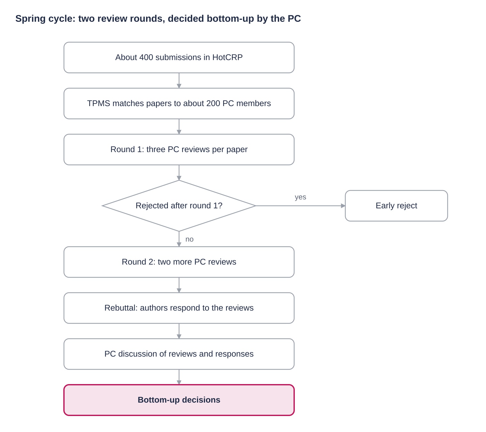
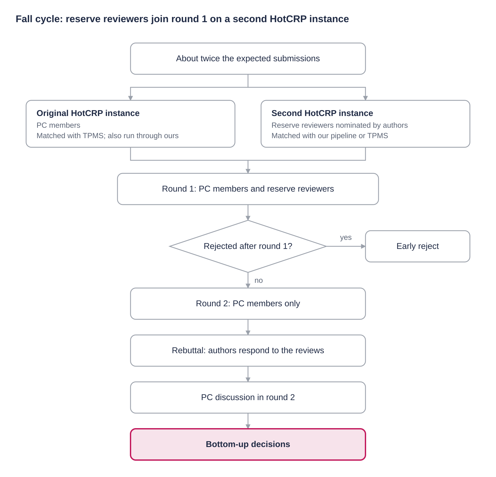

# Scaling the Review Process of Systems Conferences

**Lydia Y. Chen**, Professor, University of Neuchatel· [lydiaychen.com](https://lydiaychen.com/)

*September 29, 2026*

## Why this post

Reviewing does not scale linearly: going from 200 to 1,200 submissions changed almost every step of how we ran the program committee. I learned this as PC co-chair of Middleware'25 (about 200 submissions), DSN (about 350) and EuroSys (about 1,200). All three used HotCRP as the submission system.

At 200 papers, a chair can still eyeball conflicts and hand-tune assignments. At 1,200 papers, every manual click is multiplied by hundreds of reviewers, and every email round trip with an external service costs days you do not have. What saves you is preparation before the deadline and scripts that turn HotCRP exports into decisions.

This post shares what we did, what broke, and what I would do again. I hope it is useful to future chairs, and I would love to hear how others handle the same problems. It reflects **my personal views only, which my co-chairs may not share, and errors may remain**.

I am grateful to Paul Gratz (Texas A&M) and Mark Silberstein (Technion) for generously sharing their experience in our discussions about running large program committees. Many ideas in this post took shape in those conversations.

A big thank-you to my students, Zhiwen Soi and Nicolas van Shaik, for all their help behind the scenes.

A heartfelt thank-you to my co-chairs: Mohammad Sadoghi (UC Davis) at Middleware'25, Miguel Correia (INESC-ID) at DSN'26, and Pramod Bhatotia (TU Munich) and Andreas Haeberlen (UPenn) at EuroSys'27. None of this would have been possible without them.

## Four decisions that shape everything else

Before any paper arrives, the chairs make four decisions. Each one constrains what you can automate later.

### 1. Which review system?

The system has to cover the whole lifecycle, not just review forms. The functions we relied on were:

- **Bidding** by reviewers on papers they want or feel qualified for.
- **Matching** of papers to reviewers, either built in or imported from an external tool.
- **Publication records** of reviewers and authors, which feed both conflict detection and expertise.
- **Discussion** among reviewers, ideally with per-paper threads and chair visibility.
- **Rebuttal**, **shepherding** and **camera-ready** handling after decisions.

HotCRP covers all of these. Its real strength at scale is that almost everything can be exported as CSV or JSON and bulk-imported back. That is what makes scripting possible.

### 2. Who should review?

Two criteria dominate. First, the reviewers' combined expertise must cover the topics of the submitted papers, not the topics you expected. Second, conflicts of interest must be known and correct, because a wrong conflict either leaks a review or blocks a good assignment.

At large scale, the PC alone is not enough. This is where reserve reviewers recruited from the authors come in (see below).

### 3. Which matching algorithm?

Matching has two parts: computing a score for every paper-reviewer pair, and turning scores into an assignment.

**Signatures.** A paper's signature is usually built from its abstract or full PDF. A reviewer's signature is built from their past publications, and here the design space is large:

- What text to use: full PDFs, abstracts, or only titles.
- How far back: the last few years, or the whole career.
- Which venues: everything including arXiv, or only peer-reviewed venues.

**Scores.** The similarity between the paper vector and the reviewer's expertise vector is the match score. Cosine similarity is the common choice.

**Assignment.** Given the scores, you still choose an objective. Maximizing the total score gives the best average match but can leave some papers with weak reviewers. Maximizing the worst match protects every paper but can lower the average. At 1,200 papers, the unlucky tail is large, so this choice matters.

### 4. How should reviews run?

The review process itself is a set of choices. Is there bidding or not? One review round, two, or more? Do reviewers read the first two pages or the entire paper? Is there an early-reject point? An author response? Shepherding? Every option costs effort from both chairs and reviewers, so decide up front how much time you can afford to spend. This post does not go deep into those choices; it focuses on the process we followed, the reasons behind it, and the scripts we built.

## Publication databases and reviewer identity

Every matching algorithm, whether TPMS or our own, rests on one foundation: a unique and accurate publication track record for every author and reviewer. That means two things per person: a reliable identity, which drives conflict detection, and a publication record rich enough to describe their expertise, which drives the affinity scores. No single database gives both. Here is how the four sources we worked with compare.

|  | ORCID | DBLP | OpenAlex | TPMS |
| --- | --- | --- | --- | --- |
| **Unique ID** | ORCID iD, owned by the researcher | DBLP pid | OpenAlex author ID | Profile email |
| **How records get in** | Authors add their own publications | Pulled in automatically, then verified by humans | Scraped automatically | Tracked from associated venues; users can also curate their profile and upload their own papers |
| **Content** | Metadata | Metadata, no abstracts | Metadata with abstracts | Title, abstract and PDF |
| **Strength** | Unambiguous identifier | Clean, curated records | Abstracts come for free | Affinity vectors from title, abstract and PDF are straightforward |
| **Weakness** | Often outdated; hard to rely on for automation | Needs another source for abstracts | Messy entries | Coverage follows its associated venues |

**ORCID** is a truly unique identifier, but its database is often outdated because authors must add their publications themselves. It is excellent as a key and weak as a publication source.

**DBLP** is a good source of publication records for computer science. Entries are pulled in automatically and then verified by humans, so the data is clean. It does not store abstracts.

**TPMS** tracks authors publishing in the venues it is associated with: the major AI, ML and data-mining conferences, essentially those run on OpenReview and Microsoft CMT. Users can also curate their own profiles and upload their own papers. This makes it straightforward to build reviewer affinity vectors from titles, abstracts and full PDFs.

**OpenAlex** scrapes publication records automatically and stores their abstracts. The entries are messy, but the abstracts come along conveniently.

### The hard part: knowing who is who

The overall challenge is identifying unique people from names, emails and affiliations. This is particularly tricky for common names, for example many Asian names such as Li Zhang or Chen Wang, which are shared by many researchers. It is also hard for authors who change affiliations frequently, since their emails and institutions change with them. A wrong merge gives a reviewer someone else's expertise and conflicts; a wrong split hides real conflicts.

The sections below show how this plays out in practice. TPMS relies on its own curated profiles, keyed by email. Our pipeline uses ORCID as the key and treats the other databases as sources of content: DBLP for the publication list and OpenAlex for the abstracts.

## Background: why we ran two matching routes at EuroSys

EuroSys has two submission cycles, spring and fall. In the spring cycle we had about 400 submissions and about 200 PC members, so we ran two rounds of reviews with the PC, using HotCRP with TPMS for matching.

The fall cycle was different. We received about twice as many submissions as we expected, and we only realized it after the abstract deadline. We simply did not have enough PC members to carry the load of two review rounds. Drawing on the experience of HPCA and several AI conferences, we decided to recruit authors as reserve reviewers.

TPMS works well, but getting TPMS profiles in place for all the reserve reviewers takes time. So we prepared two matching solutions in parallel: the usual HotCRP + TPMS route, and our own matching pipeline, modeled on what HPCA 2027 had done. The success of HPCA 2027, and the fact that its tooling is open source, gave us the confidence to build our own.

The next sections walk through each cycle: the spring cycle with HotCRP and TPMS, then the fall cycle, where we added reserve reviewers, a second HotCRP instance and our own matching pipeline.

## EuroSys'27 spring: HotCRP with TPMS

The spring cycle used two review rounds. In round 1, each paper received three reviews, and papers could be rejected based on them. The remaining papers went to round 2 and received two more reviews. Authors then had a rebuttal phase to respond to the reviews, after which the PC discussed the reviews together with the author responses. Decisions were made bottom-up, from that discussion.

*Papers rejected after round 1 leave early; the rest get two more reviews, a rebuttal and a PC discussion.*

We chose not to rely on bidding. Going through a large number of submissions to bid, and ticking conflict-of-interest forms against a large PC, does not scale. Instead, we used TPMS (the Toronto Paper Matching System) for automatic paper matching, following the practice of EuroSys'26 and EuroSys'24. TPMS is nicely integrated into the CMT and OpenReview submission platforms, but as of now it is not linked to HotCRP. The rest of this section shares our experience of combining TPMS with HotCRP.

**How TPMS matching works.** TPMS computes an affinity score for every paper-reviewer pair from text. It builds a profile for each reviewer from their past publications, represents the submission and the reviewer's papers in a shared vector space, and scores their similarity. The original TPMS used bag-of-words (TF-IDF-style) and LDA topic representations; newer matching services, such as OpenReview's, compute similarity from document embeddings like SPECTER, the same family of models our own pipeline uses. The scores then go into an optimizer that maximizes total affinity subject to constraints on reviewer load and reviews per paper, often combined with bids and subject-area matches.

**Bidding is possible in TPMS.** We let TPMS alone decide the matching. In some cases the outcome is poor, meaning the affinity scores are low, for example below 75. Another way to fix such mismatches is bidding. EuroSys'24 and EuroSys'26 ran bidding in parallel with TPMS, in different ways: EuroSys'24 first gave reviewers a set of around 40 papers with high TPMS scores to bid on, while EuroSys'26 simply asked reviewers to bid as usual. HotCRP then combines the bid scores with the TPMS scores into the final scores used for matching. The bidding scores and their ranges are configurable in the HotCRP JSON settings. **The exact number mentioned may be incorrect**

TPMS works well, but it is an external service run by people over email. Budget 2 days for every correction round trip and 3-5 days for the main scoring run. Most of the work is making sure you never need a second round trip.

**Pros and cons of two review rounds.** Two rounds filter out a large share of papers early and reduce the reviewing load. However, they add a lot of management overhead for the chairs, and reviewers constantly receive reminders for one step or another. It is exhausting, especially since a heavy discussion phase follows at the end of reviewing.

### Before the abstract deadline

1. **Every reviewer needs a TPMS profile** populated with their recent publications. A reviewer without a profile gets meaningless scores.
2. **Align identities.** The TPMS ID (an email) must match the reviewer's HotCRP email. If it does not, collect the mapping now, not after submission. Even simpler: ask PC members to use the same email in both systems.
3. **Verify with TPMS early and repeatedly.** Send your reviewer list to TPMS and ask them to confirm every profile exists. TPMS returns a detailed report, including the number of publications in each profile. You can repeat this as often as needed.
4. **Fix incomplete or incorrect profiles immediately.** Each fix requires contacting TPMS staff, about 2 days per round trip. Be as close to perfect as possible before papers arrive.

### After the submission deadline

1. **Finalize the reviewable set.** Automate the desk-reject rules: submission limits per author, missing or inappropriate form fields, and format violations. HotCRP's CSV and JSON exports are the raw input for these scripts. The scripts filter out most cases; the rest, especially formatting issues, need manual inspection. One important question is how strictly to enforce these rules, especially when authors request changes after submission.
2. **Resolve conflicts of interest in HotCRP.** HotCRP flags potential conflicts on its assignment-conflict page, an HTML list per reviewer. Each one must be confirmed or dismissed. The list can approach reviewers-papers entries, so clicking through it in the web interface is not realistic. We wrote a script that extracts the key fields from that HTML into a CSV for fast review. Skipping this step is costly: unresolved conflicts make the later bulk import of the TPMS assignment fail.
3. **Prepare the three TPMS input files.** Each needs a specific format, so expect to reshape HotCRP's exports:
    - Submitted PDFs, named with TPMS's required paper-ID format (mandatory).
    - The reviewer list: TPMS email, name, and number of papers each will review.
    - Reviewer conflicts, which can be downloaded directly from HotCRP.
4. **Send the files to TPMS by email and wait.** Expect 3–5 days, depending on how clean your files are and how busy the TPMS team is. Line up the timing with them in advance so they expect your files.
5. **Receive scores and a proposed assignment.** The score file is the most valuable output. It holds the affinity score for every paper–reviewer pair, so you can rerun or adjust the assignment yourself instead of depending on a single proposal. Alternatively, import the scores into HotCRP as review preferences for each paper–reviewer pair and let HotCRP compute the assignment from them.
6. **Handle a second review round.** If your conference has two review rounds, there are two options. The first is to repeat the TPMS process and include the round-1 assignment; otherwise TPMS assumes its first proposed assignment was used and continues from there. The second is to import the normalized scores as preferences for each paper–reviewer pair and run the assignment directly in HotCRP.

The lesson: TPMS quality depends on profile quality, and the timeline depends on how few round trips you need. You can also ask the TPMS team for a report on matching quality.

## EuroSys'27 fall: reserve reviewers, two HotCRP instances and two matching routes

**A big thank-you first.** One hidden but crucial factor in pulling this off was the real-time management of reviewers and authors. My co-chair Andreas Haeberlen dedicated many hours to handling every request with great patience, which kept the review process running smoothly. Without that effort, a process like this can easily fail.

To handle the surge in submissions, we changed three things at once: we recruited additional reviewers, we changed the review process, and we changed the matching. At the same time, we wanted to keep the two-round review structure that EuroSys relies on:

- **Round 1:** PC members and reserve reviewers review together. Reserve reviewers help with round 1 only.
- **Round 2:** only PC members review.
- **Decisions:** after a rebuttal phase, final decisions are made bottom-up, through the round-2 discussion among the PC.

*Round 1 runs on two HotCRP instances in parallel; round 2, the rebuttal and the decisions stay with the PC.*

For PC members, we ran the assignment through TPMS rather than our own pipeline, following essentially the same process as in the spring cycle. All PC members already had correct TPMS profiles, so TPMS matching ran smoothly without extra delay. We also computed an assignment with our own pipeline.

The key point is that either matching route can serve either group. Our pipeline copes better with varying input quality, such as incomplete or incorrect reviewer information, whereas TPMS places higher demands on its inputs.

The rest of this section covers how we recruited the reserve reviewers and how we ran them on a second HotCRP instance. The next section describes our own matching pipeline.

### Recruiting reserve reviewers from authors

There are many ways to grow the reviewer pool from the author community. Here is what we did in the EuroSys'27 fall cycle.

#### Before the submission deadline

1. **Change the submission form as soon as the abstract deadline is known.** We added a required field asking each submission to nominate one reserve reviewer with PhD-equivalent experience: name, email and website. *Improvement for next time:* use separate, structured fields for each item so the answers need no cleanup before selection.
2. **Prepare the desk-reject script** to check (i) the number of submissions per unique author, (ii) whether a reserve reviewer was provided, and (iii) formatting.
3. **Prepare the reserve-reviewer extraction script.** It pulls the nominees and adds attributes useful for selection, such as how many papers the nominee submitted and how many publications they have in recent years according to their ORCID.

#### After the submission deadline

1. **Decide desk rejects and notify authors as soon as possible.** Early notice is fairer to authors and shrinks the pool you have to process.
2. **Vet the nominees.** Exclude nominees from desk-rejected papers and those who are already on the PC (some authors simply named an existing PC member). Then inspect the rest one by one. The number of DBLP papers found by our pipeline was one of the most useful signals.
3. **Expect a wave of change requests.** Many authors ask to update submission metadata or the submission itself. My co-chair Andreas (UPenn) spent hours answering these emails.
4. **Expect a second wave from desk-rejected authors.** Clear, rule-based rejection criteria, stated in the call for papers, make these replies much faster.

### Running reserve reviewers on a second HotCRP instance

We deliberately ran the reserve reviewers on a separate, second HotCRP instance. The benefit is that the two streams of reviewers do not interfere with each other. The downside is the management overhead and the work of keeping the two sites in sync.

Setting up and running the second instance took these steps:

1. **Create the instance** before the submission deadline, with the same configuration as the original, by importing the original's configuration JSON.
2. **Import the reserve reviewer list**, as clean and complete as possible: email, name, affiliation, and a tag linking each reviewer to their original submission.
3. **Import the submissions.** We underestimated this step. There is no easy web interface for it, so we used the HotCRP API to upload the original submission data: the PDFs and the JSON metadata.
4. **Resolve conflicts of interest flagged by HotCRP**, using the same script as in the original instance.
5. **Run our matching pipeline.** Download the input files and feed them into our pipeline. We tuned the hyperparameters and compared the resulting assignments, for example by limiting how many of a paper's reviewers can come from the same country. The assignment is ready shortly afterwards.
6. **Or use TPMS.** Alternatively, send the input files to TPMS, wait for them to flag any anomalies to fix, and then receive the assignment. The round-trip time varies widely, depending on the quality of the input files and the TPMS team's schedule.

The key design decision for the second instance is the review form. Do PC members and reserve reviewers use the same form? What should be the same, and what should differ? What is sent to authors, and what is not? And should decisions be made in the original instance or in the second one?

In our case, the original instance handled PC reviews and the second instance handled reserve reviewers. Both used the same numerical scores, but with differently worded questions, to reflect the different levels of expertise and experience among reserve reviewers.

## EuroSys'27 fall: our own matching pipeline

For the second route, we built our own pipeline on open data. It builds on the reviewer-paper matching tool that Paul Gratz developed for the HPCA 2027 program committee ([hpca2027-reviewer-match](https://github.com/pgratz1/hpca2027-reviewer-match)), and we are grateful to him for making it available. Like the HPCA tool, we use SPECTER2 to embed papers and compute reviewer–paper affinity from those embeddings.

We made two main changes on top of the HPCA pipeline. First, we build each reviewer's publication record from their ORCID, whereas the HPCA tool uses the DBLP entry provided by each reviewer. Second, our reviewer affinity vector is based on the titles and abstracts of their papers, extracted automatically from OpenAlex, whereas the HPCA tool relies on titles. As a result, the backbone of our pipeline is one identifier: ORCID. We will open-source the pipeline soon.

The table below compares the three matching routes: TPMS alone, the HPCA 2027 tool, and our pipeline.

|  | TPMS only | HPCA 2027 tool | Our pipeline |
| --- | --- | --- | --- |
| **Conflict-of-interest inputs** | HotCRP conflict file | HotCRP conflict file, plus publication history from the unique DBLP entry each reviewer provides | HotCRP conflict file, plus publication history from DBLP entries found through each reviewer's ORCID |
| **Affinity vector built from** | PDFs of the reviewer's recent publications | Titles of recent publications | Titles and abstracts of recent publications |
| **"Recent publications" window** | Not set by the chairs | Configurable | Configurable |

### Conflicts of interest

- Author–reviewer conflicts are derived from ORCID entries in DBLP, which gives us co-authorship automatically.
- Collaboration and institutional history flagged by HotCRP is added on top.

### Expertise signatures

- A reviewer's signature uses their publications from the past four years in DBLP, **excluding arXiv preprints**, plus the topics of interest they declare in HotCRP.
- DBLP has no abstracts, so we fetch each paper's title and abstract automatically from OpenAlex and embed them with SPECTER2 to form the signature vectors.
- Each submission gets a SPECTER2 signature from its own abstract.

### Scores

The match score for a paper–reviewer pair is the cosine similarity between the reviewer's expertise signature and the paper's abstract signature.

### Inputs from HotCRP

The pipeline needs four HotCRP exports. Each has one precondition that must hold, or the results are wrong.

| File | What it provides | Must be true before export |
| --- | --- | --- |
| `pcconflict` | Confirmed reviewer conflicts | Every HotCRP-flagged conflict is resolved. Otherwise the bulk assignment import fails. |
| `pcinfo` | PC members and reviewers | Every reviewer has entered an accurate ORCID. It is the key for automatic conflict detection. |
| `data.json` | Submissions and metadata | Every author has provided an ORCID. |
| `authors.csv` | Author list per paper | Every author has provided an ORCID. |

The practical consequence: make ORCID mandatory in both the PC profile and the submission form, and check it before the deadline, not after.

## Lessons for future chairs

The common thread: at scale, the review process is a data pipeline, and its quality is set before the deadline. A short checklist:

- Make ORCID mandatory for every reviewer and every author, and verify it before submissions close.
- If you use TPMS, confirm every reviewer profile weeks ahead and align TPMS and HotCRP emails.
- Decide how reviewer signatures are built: which years, which venues, and whether arXiv counts.
- Choose the assignment objective explicitly: best average match or protecting the worst-matched papers.
- Script desk-reject checks and conflict verification against HotCRP exports before the deadline.
- Resolve all HotCRP-flagged conflicts before any bulk assignment import.
- Put reserve-reviewer nomination in the submission form, with structured fields.
- Decide early whether reserve reviewers get their own HotCRP instance, and budget time for importing submissions through the API.
- Plan chair time for the two email waves after the deadline.

We will open-source everything soon: our scripts for HotCRP and TPMS and our matching pipeline. If you are chairing a systems conference soon and want to compare notes or reuse our scripts, feel free to reach out.
